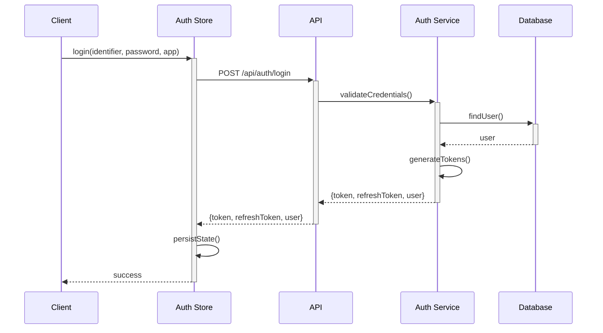
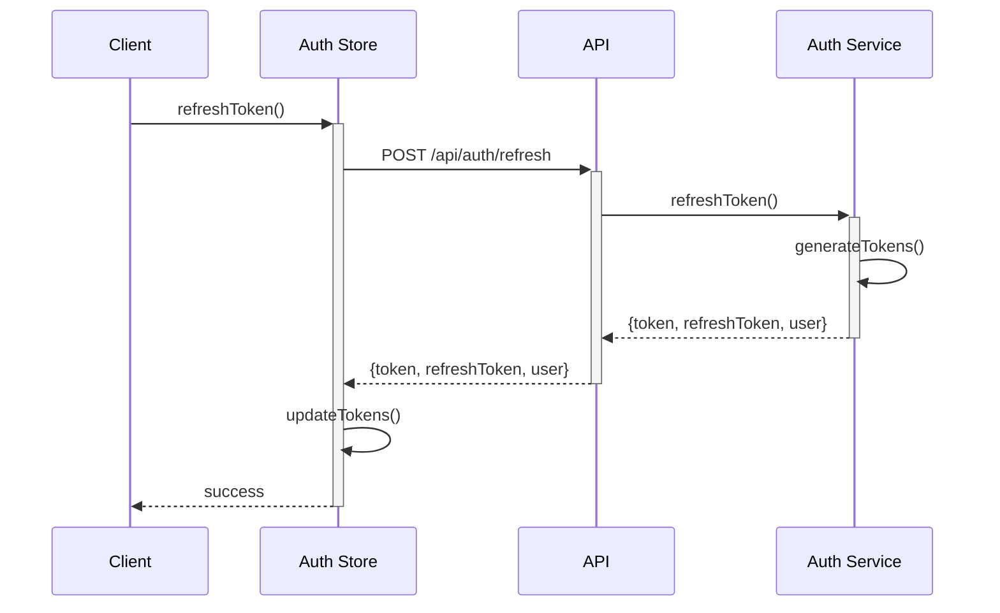

# BaseGeek Authentication System

## Overview
The BaseGeek authentication system is a centralized authentication solution designed to work across all GeekSuite applications. It provides a unified login experience, shared user management, and secure token-based authentication with refresh token support.

## Core Components

### 1. Shared Auth Store (Frontend)
Location: `baseGeek/packages/ui/src/store/sharedAuthStore.js`

The shared auth store is a Zustand-based state management solution that handles:
- Authentication state persistence
- Token management (access and refresh tokens)
- User session management
- Cross-app authentication synchronization
- Automatic token refresh

Key features:
- Persistent storage of auth state
- Automatic token validation and refresh
- Cross-app auth state broadcasting
- Rate limiting protection
- Error handling

### 2. Authentication Middleware (Backend)
Location: `baseGeek/packages/api/src/middleware/auth.js`

The authentication middleware provides:
- JWT token validation
- App-specific access control
- Request authentication
- Error handling

### 3. Auth Service (Backend)
Location: `baseGeek/packages/api/src/services/authService.js`

Handles core authentication operations:
- User login
- Token generation (access and refresh tokens)
- Token validation
- Token refresh
- Password hashing

## Authentication Flow

### 1. Login Process


### 2. Token Refresh


## API Endpoints

### Authentication Endpoints

#### Login
```http
POST /api/auth/login
```
Request:
```json
{
    "identifier": "string",  // username or email
    "password": "string",
    "app": "string"         // 'basegeek', 'notegeek', or 'bujogeek'
}
```
Response:
```json
{
    "token": "string",          // Access token
    "refreshToken": "string",   // Refresh token
    "user": {
        "id": "string",
        "username": "string",
        "email": "string",
        "app": "string"
    }
}
```

#### Register
```http
POST /api/auth/register
```
Request:
```json
{
    "username": "string",
    "email": "string",
    "password": "string",
    "app": "string"
}
```
Response: Same as login

#### Validate Token
```http
POST /api/auth/validate
```
Request:
```json
{
    "token": "string",
    "app": "string"
}
```
Response:
```json
{
    "valid": true,
    "user": {
        "id": "string",
        "username": "string",
        "email": "string",
        "app": "string"
    }
}
```

#### Refresh Token
```http
POST /api/auth/refresh
```
Request:
```json
{
    "refreshToken": "string",
    "app": "string"
}
```
Response:
```json
{
    "token": "string",          // New access token
    "refreshToken": "string",   // New refresh token
    "user": {
        "id": "string",
        "username": "string",
        "email": "string",
        "app": "string"
    }
}
```

## Security Features

### 1. Token Security
- JWT-based authentication with separate access and refresh tokens
- Short-lived access tokens (1 hour by default)
- Long-lived refresh tokens (7 days by default)
- App-specific token claims
- Secure token storage

### 2. Rate Limiting
- Login attempts: 5 per 15 minutes
- IP-based rate limiting
- Configurable limits per endpoint

### 3. Password Security
- Bcrypt password hashing
- Minimum password requirements
- Secure password storage

### 4. Cross-App Security
- App-specific token validation
- Secure cross-app communication
- Protected API endpoints

## Environment Variables

Required environment variables:
```env
# JWT Configuration
JWT_SECRET=your-secure-secret-key
JWT_REFRESH_SECRET=your-secure-refresh-secret-key
JWT_EXPIRES_IN=1h
REFRESH_TOKEN_EXPIRES_IN=7d

# Rate Limiting
AUTH_RATE_LIMIT=5
AUTH_RATE_WINDOW=900000
```

## Best Practices

1. **Token Management**
   - Store tokens securely
   - Implement automatic token refresh
   - Handle token expiration
   - Use refresh tokens for long-term sessions

2. **Error Handling**
   - Implement proper error boundaries
   - Handle network errors
   - Provide user feedback
   - Log authentication failures

3. **Security**
   - Use HTTPS
   - Implement CSRF protection
   - Follow OWASP guidelines
   - Validate all inputs

4. **Performance**
   - Implement caching
   - Optimize token validation
   - Use efficient storage
   - Monitor token usage

## Migration Guide

To migrate an existing app to use BaseGeek auth:

1. **Frontend Migration**
   - Install BaseGeek UI package
   - Replace existing auth store
   - Update components to use shared store
   - Implement refresh token handling

2. **Backend Migration**
   - Configure JWT secrets
   - Update token validation
   - Implement refresh token endpoints
   - Update rate limiting

3. **Security Updates**
   - Implement CSRF protection
   - Update CORS configuration
   - Add rate limiting
   - Configure secure headers

## Error Handling

### Common Error Codes
| Code | Description | HTTP Status |
|------|-------------|-------------|
| `AUTH_RATE_LIMIT` | Too many login attempts | 429 |
| `LOGIN_ERROR` | Invalid credentials | 401 |
| `TOKEN_VALIDATION_ERROR` | Invalid token | 401 |
| `TOKEN_REFRESH_ERROR` | Refresh failed | 401 |
| `PROFILE_ERROR` | User not found | 404 |

### Error Response Format
```json
{
    "message": "string",
    "code": "string",
    "details": {} // Optional
}
```

## Troubleshooting

### Common Issues

1. **Token Validation Fails**
   - Check JWT_SECRET
   - Verify token format
   - Check expiration

2. **Cross-App Auth Issues**
   - Verify app names
   - Check token claims
   - Validate permissions

3. **Rate Limiting**
   - Check rate limit settings
   - Verify IP tracking
   - Monitor limits

## Support

For issues and support:
1. Check the BaseGeek documentation
2. Open an issue in the BaseGeek repository
3. Contact the GeekSuite team